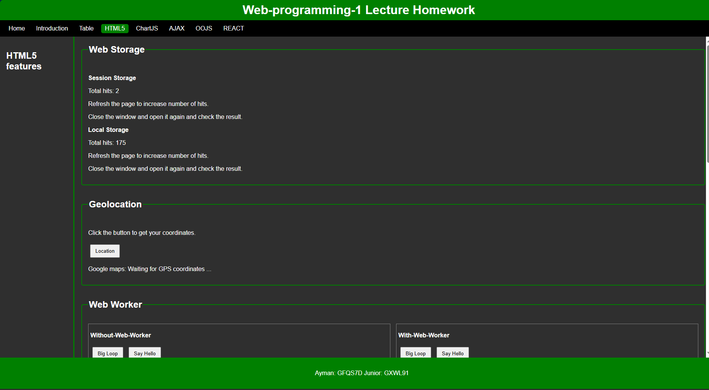

# Web Programming 1 Lecture Project

Welcome to the **Web Programming 1 Lecture Project**, developed by **Ayman** and **Junior** as part of our university coursework. This project showcases our understanding and application of various web programming concepts, including HTML, CSS, JavaScript, and PHP.

---

## Table of Contents

-   About the Project
-   Features
-   Technologies Used
-   Setup and Installation
-   Usage
-   Screenshots
-   Future Enhancements
-   Contributors

---

## About the Project

This project is a culmination of our learnings from the **Web Programming 1** lecture. It involves building a functional and visually appealing web application that incorporates front-end and back-end technologies. The focus is on implementing best practices in web development and creating an interactive user experience.

---

## Features

-   **Responsive Design**: The website is fully responsive and optimized for various screen sizes, including mobile, tablet, and desktop devices.
-   **User Authentication**: Includes secure login and registration functionality (if applicable).
-   **Dynamic Content**: Utilizes JavaScript to dynamically update and manipulate the DOM for better user interactivity.
-   **Form Validation**: Front-end and back-end form validation to ensure data integrity.
-   **Interactive Elements**: Features like sliders, modals, and dropdowns for an enhanced user experience.
-   **Database Integration**: Stores and retrieves data using a connected backend (if applicable).
-   **Custom Styling**: Aesthetic and professional UI/UX design using CSS.
-   **Additional Functionalities**: Add any other specific features here (e.g., API integrations, animations, etc.).

---

## Technologies Used

-   **HTML**: For structuring the web pages.
-   **CSS**: For styling and layout design.
-   **JavaScript**: For interactivity and dynamic content.
-   **PHP** (optional): For server-side scripting and backend functionalities.

---

## Setup and Installation

To run this project locally, follow these steps:

1.  Clone the repository:
    ```bash
    git clone https://github.com/qaisari/Web-programming-1-Lecture-Homework.git
    ```
2.  Navigate to the project directory:
    ```bash
    cd Web-programming-1-Lecture-Homework
    ```
3.  Open the `index.html` file in your browser to view the front-end.
4.  If using PHP, ensure you have a server (e.g., XAMPP) running and place the project folder in the server's directory.

---

## Usage

1.  Open the project in your browser.
2.  Explore the features such as user authentication, form submissions, and other interactive elements.
3.  Modify the code to experiment with different web programming techniques.

---

## Screenshots

### Screenshot 1: [Add description here]



### Screenshot 2: [Add description here]


---

## Future Enhancements

In future iterations, we plan to:

-   Add more advanced functionalities.
-   Optimize the code for better performance.
-   Enhance the UI/UX design.
-   Implement additional security measures.

---

## Contributors

-   **Ayman**
-   **Junior**

---

Thank you for exploring our project! If you have any feedback or suggestions, feel free to reach out.
